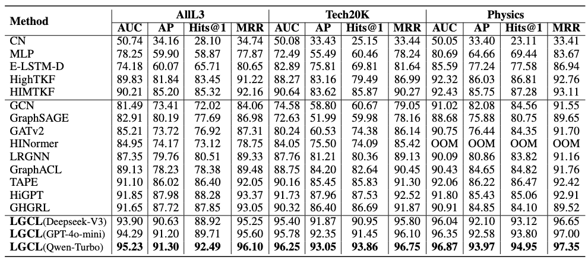

## Codes for "LLM-enhanced Graph Contrastive Learning for Technology Flow Forecasting"

## The architecture of LGCL framework

## Dataset

Raw Data: [Link](https://patentsview.org/download/data-download-tables)

The data used for the AllL3 dataset has been placed in the folder above. Due to upload capacity limitations, the Tech20K and Physics datasets will be made publicly available upon acceptance of the paper.

## Statistics of datasets, where $\beta$ indicates the proportion of intra-domain TFs among all TFs.
| Dataset | \# Nodes | \# TFs | \# TCs | \# Domains | $\beta$ |
|---------|----------|---------|--------|------------|--------|
| AllL3  | 678      | 60,153  | 32,451 | 9          | 0.26   |
| Tech20K   | 20,000   | 460,460 | 125,126| 9          | 0.58   |
| Physics   | 38,847   | 6,332,330| 2,313,910| 1        | 1      |

## Overall Performance Evaluation on Different Datasets (%). Notably, OOM indicates the out-of-memory issue.

