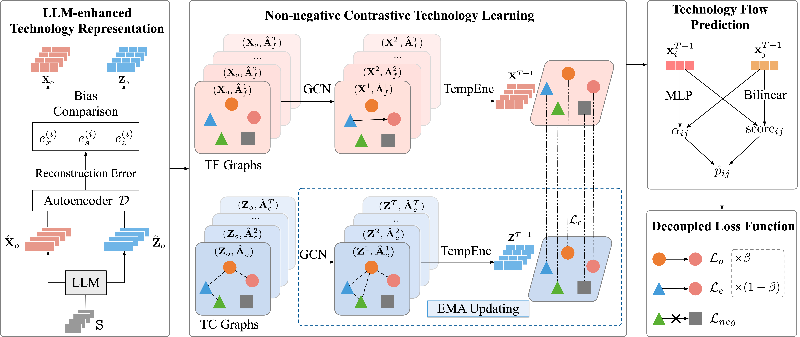

## Codes for "Technological Knowledge Flow Forecasting with LLM-enhanced Graph Contrastive Learning"

## The architecture of LGCL framework

## Dataset

Raw Data: [Link](https://patentsview.org/download/data-download-tables)

The data used for the CPC-L3 dataset has been placed in the folder above. Due to upload capacity limitations, the CPC-R and CPC-G datasets will be made publicly available upon acceptance of the paper.

## Statistics of Datasets from 2010 to 2020, where $\beta$ represents homophily ratio.
| Dataset | \# Nodes | \# TKFs | \# TCs | \# Domains | $\beta$ |
|---------|----------|---------|--------|------------|--------|
| CPC-L3  | 678      | 60,153  | 32,451 | 9          | 0.26   |
| CPC-R   | 20,000   | 460,460 | 125,126| 9          | 0.58   |
| CPC-G   | 38,847   | 6,332,330| 2,313,910| 1        | 1      |

## Overall Performance Evaluation on Different Datasets (%). Notably, OOM indicates the out-of-memory issue.

